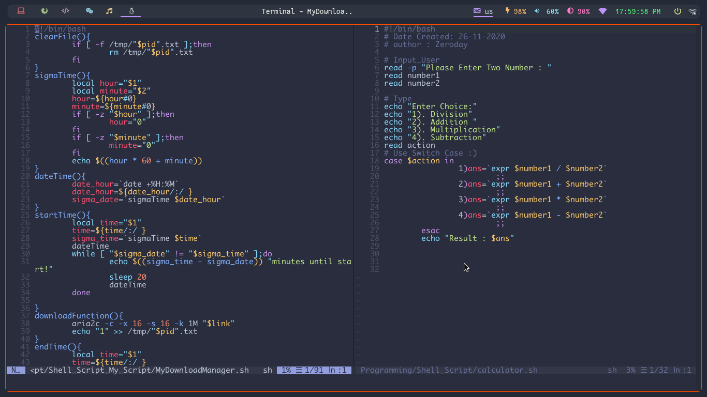

### Neovim Start Screen


### Neovim Environment


### Open A Directory


### Code Appearance


### Open [NNN](https://nnnofficial.github.io/) In Neovim By CTRL + Y


### Neovim Installation
- Arch :
```
yay -S neovim-nightly
```
### For Other Distro, See [This Page](https://github.com/neovim/neovim/wiki/Installing-Neovim)


### VIM-PLUG
- https://github.com/junegunn/vim-plug
- https://www.chrisatmachine.com/Neovim/01-vim-plug
- https://www.youtube.com/watch?v=QB9V__3VO2s
- https://github.com/junegunn/vim-plug#neovim
### Vim Plug Installation

```sh
sh -c 'curl -fLo "${XDG_DATA_HOME:-$HOME/.local/share}"/nvim/site/autoload/plug.vim --create-dirs \
       https://raw.githubusercontent.com/junegunn/vim-plug/master/plug.vim'
```


### Create A Directory For Plugins

```
mkdir ~/.config/nvim/plugins/plugged
```


### Node Js Nmp Installation

- Arch :
```
sudo pacman -S nodejs npm
```
- Debian :
```
sudo apt install nodejs npm
```


### Now , Open And Run Below Command :
```
:PlugInstall
```

### COC Installation

- Arch :
```
sudo pacman -S python python-pip  
```
- Debian :
```
sudo apt install python3-pip
```
### Now ,  Run Below Command :
```
python3 -m pip install --user --upgrade pynvim
```
### [Using coc extensions](https://github.com/neoclide/coc.nvim/wiki/Using-coc-extensions)
### Then , Open and Run Below Command :
```
:CocInstall coc-json coc-python  coc-vimlsp coc-tsserver  coc-yank coc-sh coc-clangd
```
**Key Maps** (Optional)
- You Can Use My Keys, Or Customize It For Yourself .

### Enjoy The Neovim  :smiley: 



